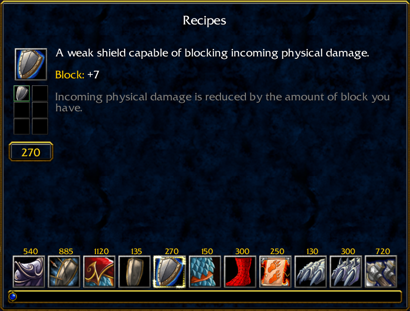
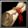

# SotE III v0.0.1

A new Warcraft III hero arena map `(by runi95)`

Table of content:

- [Win conditions](#win-conditions)
- [Resources](#resources)
- [Commands](#commands)
- [Credits](#credits)
- [Changelog](#changelog)
- [Recipe system](#recipe-system)
- [Bosses](#bosses)

## Win conditions

`3 vs 3`

Defeat the opposing team by killing their heroes until they run out of lives and can no longer respawn.

`All vs All`

Defeat all other players by killing their heroes until you're the only player with any lives left.

## Resources

Gain gold by slaying creeps found scattered all across the map. Higher level creeps tend to give more gold when defeated.

Gold can be spent at the various shops found in spawn and out on the battlefield.

Gold is also necessary when upgrading items through the [recipe system](#recipe-system).

## Commands

None yet

## Credits

- [Whirlpool](https://www.hiveworkshop.com/threads/whirlpool.47612/#resource-20373) by Mc !
- [Death Grip](https://www.hiveworkshop.com/threads/death-grip.277775/#resource-37806) by Grey Knight

## Changelog

Changelogs will be written after first test release

## Recipe system

The recipe system is used when upgrading items to a stronger version of themselves.

To upgrade an item your hero **has to be** standing in spawn so you can click the recipe button  which can be found right above your minimap.

Left clicking an item will show the recipe for that item like in the image above.

Right clicking an item will filter the item list to only show item recipes where the clicked item is used.

Once your hero is holding all the required recipe items and you have enough gold to purchase the recipe you'll be able to click the upgrade button which will remove all required items from your hero's inventory, subtract the gold cost and equip your hero with the resulting item.

## Bosses

Bosses are spawned when a hero steps inside a Circle of Power like the one shown in the image above. The size of the circle indicates the strength of the boss.

The rewards for slaying a boss is always greater when defeating a harder boss spawned from a larger circle.